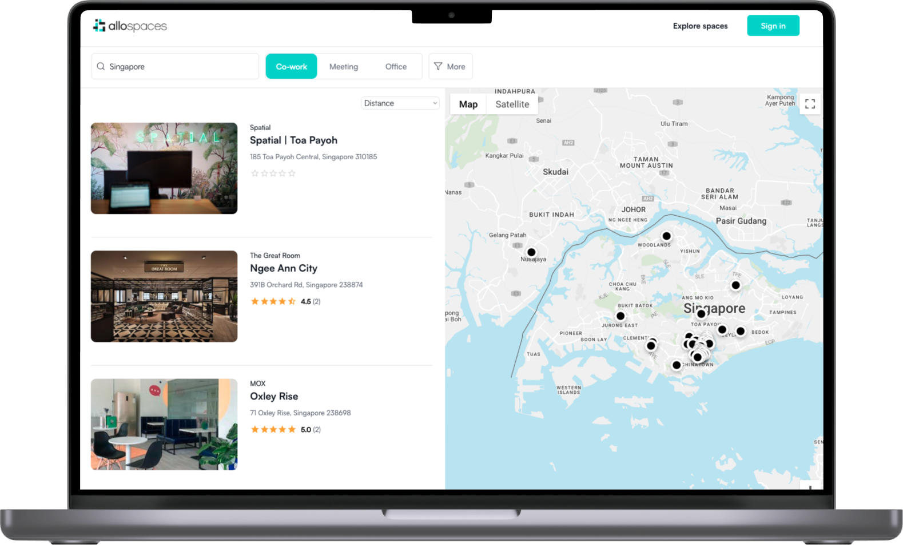

_More Screenshots of the App available at the bottom of the page._

Allospaces empowers you with unparalleled flexibility and convenience, enabling you to access a diverse range of co-working environments in Asia with a single, unified pass.

## **Key Features**

-   **Booking Management:** With Allospaces, managing your bookings has never been easier. Our user-friendly interface allows you to book spaces hassle-free, ensuring you have a productive workspace wherever you go.

-   **Credit-Based Pass:** Our innovative credit-based pass system gives you the freedom to choose your workspace based on your needs. It's a truly flexible solution, adapting to your unique requirements.

-   **Seamless Stripe Integration:** We've integrated Stripe for secure and convenient payments, ensuring a smooth and reliable experience when accessing co-working spaces, cafes, and hotels.

-   **Workplace Admin Dashboard:** Allospaces provides an intuitive admin dashboard for workplace managers. You can efficiently manage bookings, monitor occupancy, and ensure a seamless experience for your members.

-   **Company Dashboard:** For corporate clients, we offer a dedicated company dashboard, allowing you to manage and track bookings across your organization. It's a powerful tool for streamlining the co-working experience for your team.

-   **Team Bookings:** Allospaces understands the dynamics of teamwork. With our team booking feature, you can reserve spaces for your entire team, making collaboration effortless, no matter where you are.

## **Unlock the Potential of Your Online Presence with Waak Labs**

While Allospaces transforms your co-working experience, Waak Labs is your trusted partner in web development. Our expertise extends far beyond co-working platforms. We specialize in crafting custom web solutions that empower businesses to thrive in the digital world.

If you're ready to take your online presence to the next level, our dedicated team at Waak Labs is here to help. From website development to innovative digital strategies, we've got you covered.

**Contact us now and unlock a world of co-working opportunities, backed by cutting-edge web development services.**
