## **Minimalistic Design**

One of the standout features of Brickell.com is its new minimalistic design. We've crafted a sleek, user-friendly interface that not only captures visitors' attention but also encourages them to stay longer on the website. Our design choices are deliberate, focusing on simplicity, elegance, and easy navigation, creating an unparalleled user experience.

## **Enhanced SEO Performance**

In the competitive online landscape, a strong digital presence is key. With Brickell.com, we've prioritized optimizing the website for search engines. The result? Improved SEO performance that boosts your website's visibility and rankings, driving more organic traffic and potential clients to your business.

## **Customized Advanced CMS**

To cater to the unique needs of our clients, we've developed an advanced Content Management System (CMS) that's tailored specifically for Brickell.com. This CMS offers the flexibility and control you need to manage your content effectively, ensuring a seamless and efficient workflow.

## **Setting the Bar for the Competition**

Brickell.com is not just another website; it's a superior platform that outshines its competitors. Our advanced search engine is a prime example of our commitment to excellence. It offers an array of robust filters, allowing users to fine-tune their property searches. With our cutting-edge technology, finding the perfect listing has never been easier.

## **Empower Your Online Presence with Waak Labs**

Brickell.com is a testament to our web development capabilities, but our expertise extends to a wide range of digital solutions. At Waak Labs, we specialize in crafting bespoke web experiences that empower businesses to thrive in the digital realm.

If you're ready to elevate your online presence and stand out in your industry, look no further than Waak Labs. From web development to digital strategies, we have the expertise to transform your digital presence.

**Experience the excellence of Brickell.com and explore what Waak Labs can do for your business. Contact us now and unlock the full potential of your online presence with cutting-edge web development services.**

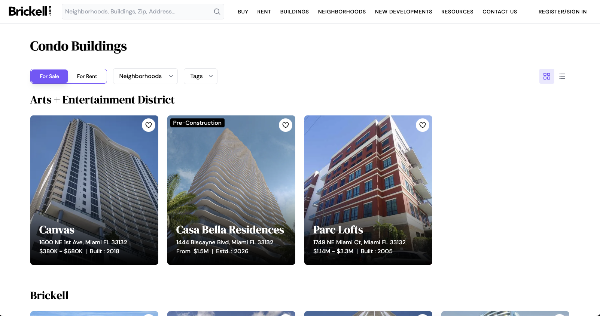

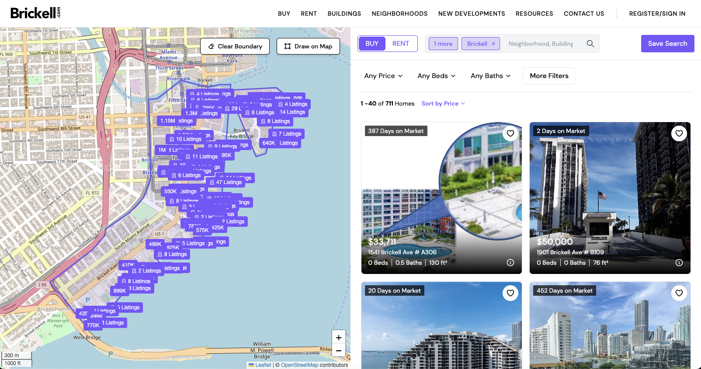

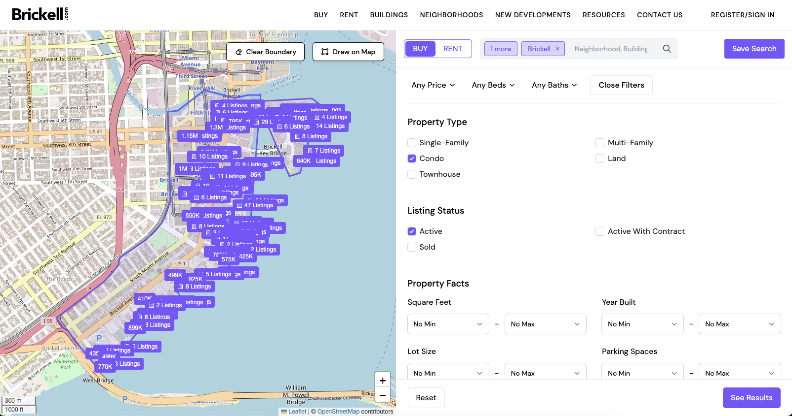
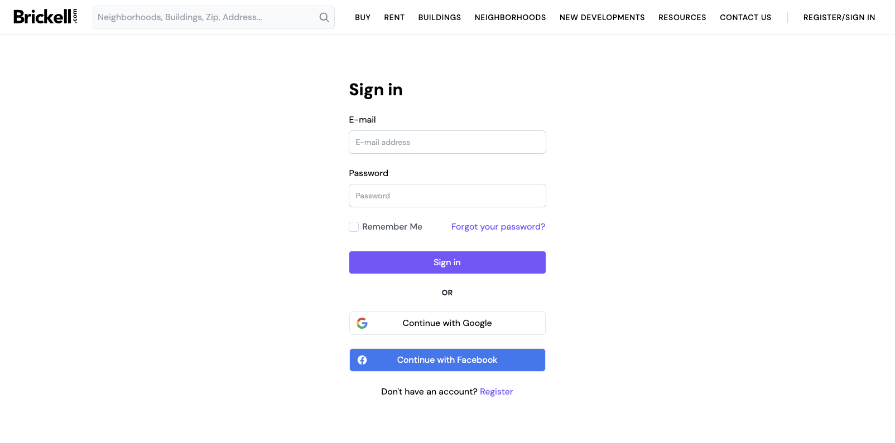

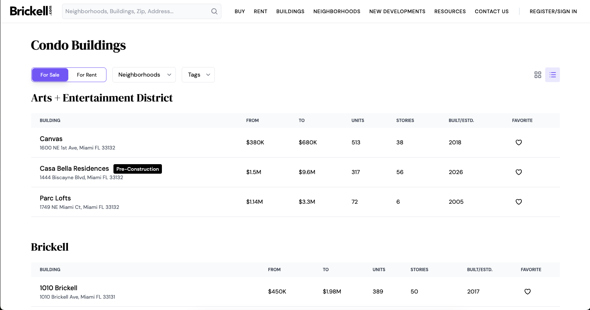
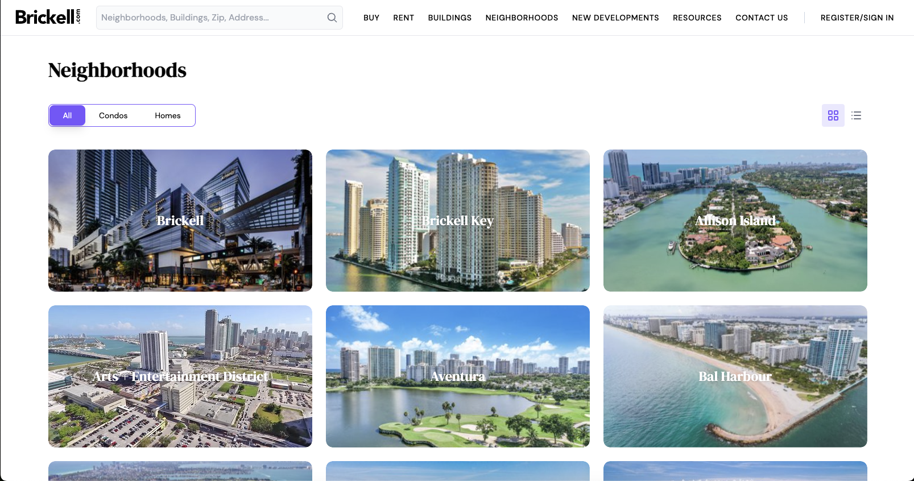
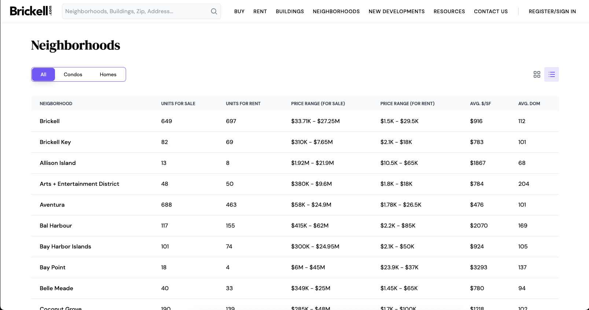
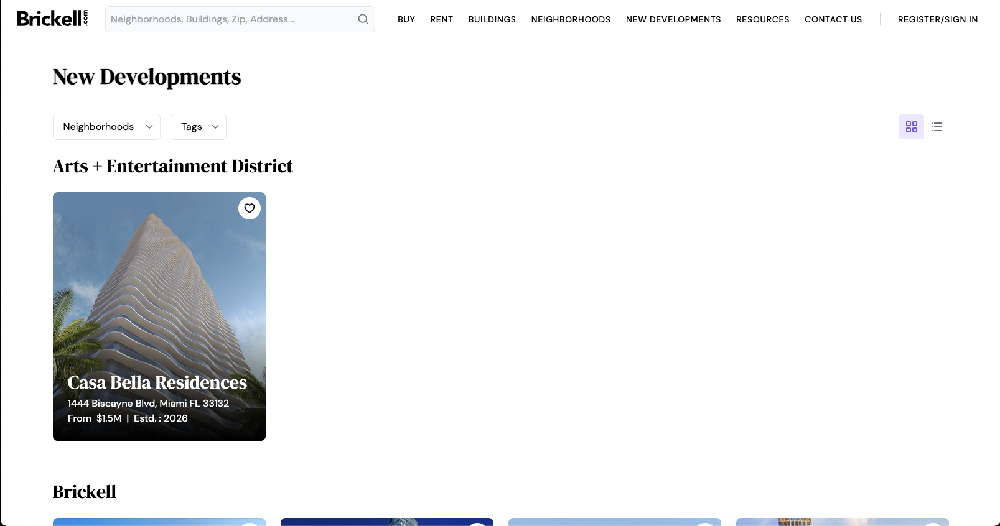
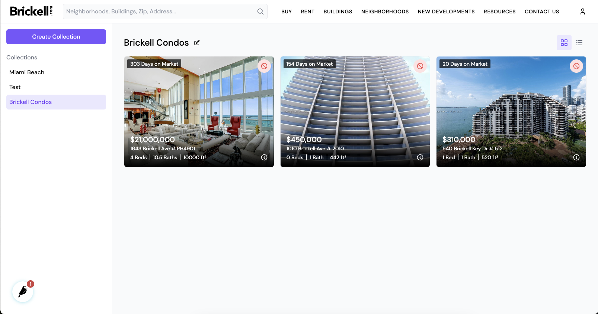

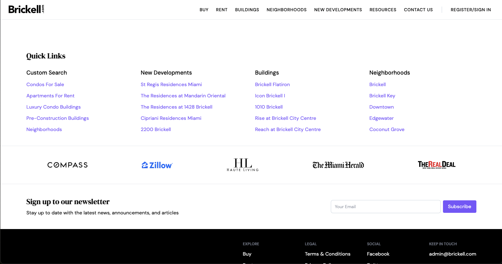
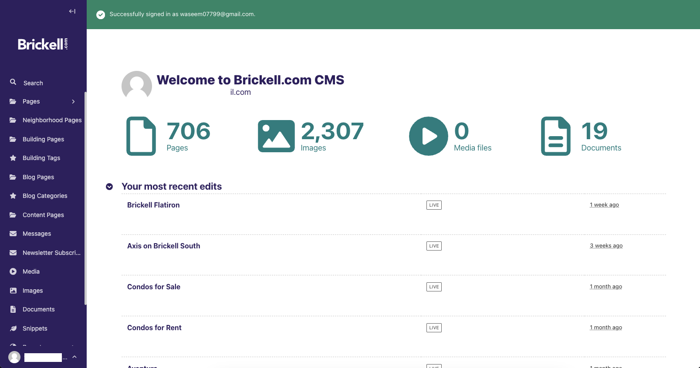
