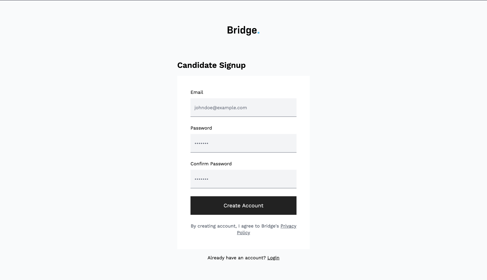
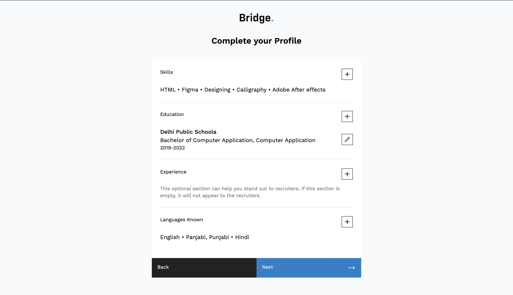

## **Simplified Management**

Bridge offers streamlined management with dedicated dashboards:

-   **Super Admin Dashboard:** Comprehensive control for administrators.
-   **Recruiter Dashboard:** Empowering recruiters with efficient tools.
-   **Candidate Dashboard:** A user-friendly space for candidates to manage their applications.

## **Efficient Application Process**

Bridge simplifies the application process by allowing candidates to respond to job postings with video answers to questions. This speeds up the candidate evaluation process, helping recruiters identify the right fit efficiently.

## **Your Online Hiring Solution with Waak Labs**

Bridge is a testament to our commitment to practical web development solutions. At Waak Labs, we specialize in creating web platforms that simplify processes. Beyond Bridge, we have a wide range of services to offer for your web development needs.

If you're ready to enhance your hiring process and explore the full potential of web development, look no further than Waak Labs. Contact us today and let us redefine your web development experience.

**Experience the convenience and efficiency of Bridge and discover what Waak Labs can do for your web development needs.**

