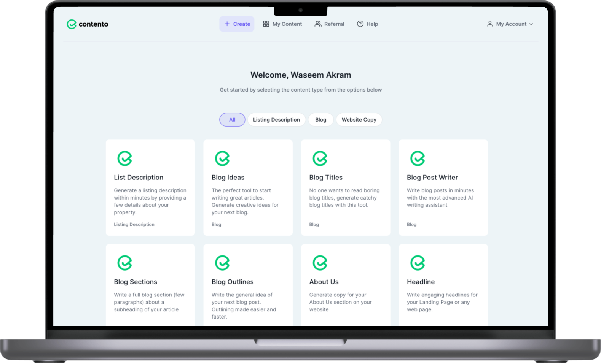

## **Key Features**

-   **GPT 3 Integration:** Bridge seamlessly integrates with GPT-3 for enhanced content creation.
-   **Rewardful for Affiliate & Referral Programs:** A built-in feature to manage affiliate and referral programs.
-   **Content Generation:** Generate a variety of content, including listing descriptions, blog ideas, titles, sections, website copy, and 'About Us' sections.
-   **Content Management:** Easily save and organize the generated content into folders for future use.

## **Streamline Your Content Creation with Waak Labs**

Bridge is a testament to our commitment to practical web development solutions. At Waak Labs, we specialize in creating web platforms that simplify content creation processes. Beyond Bridge, we offer a wide range of web development services to cater to your specific needs.

If you're ready to supercharge your content creation and explore the full potential of web development, look no further than Waak Labs. Contact us today and let us redefine your web development experience.

**Experience the versatility and efficiency of Bridge and discover what Waak Labs can do for your web development needs.**
