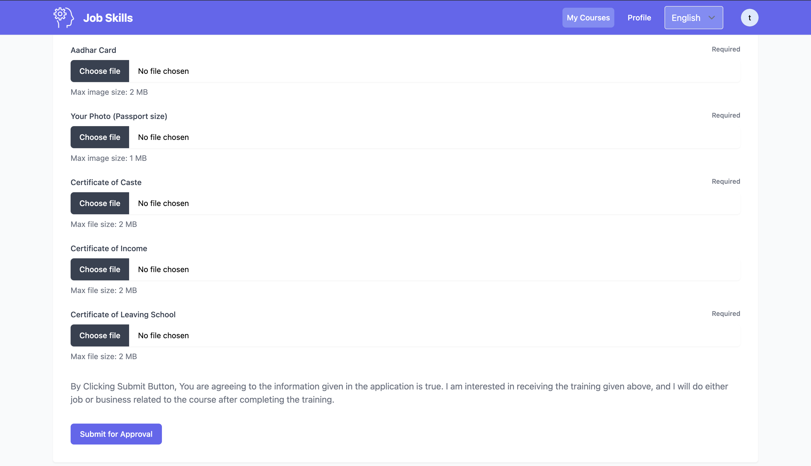
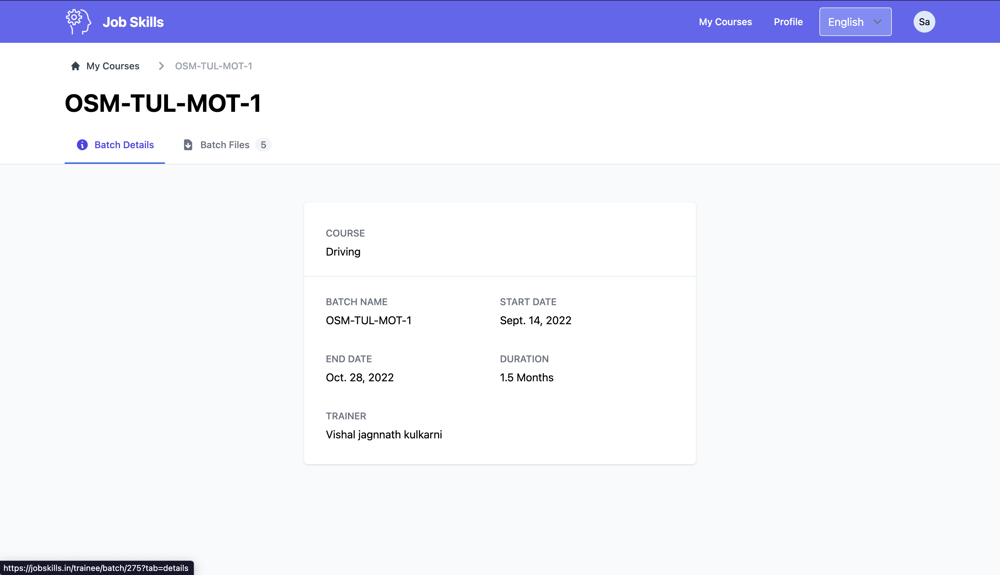
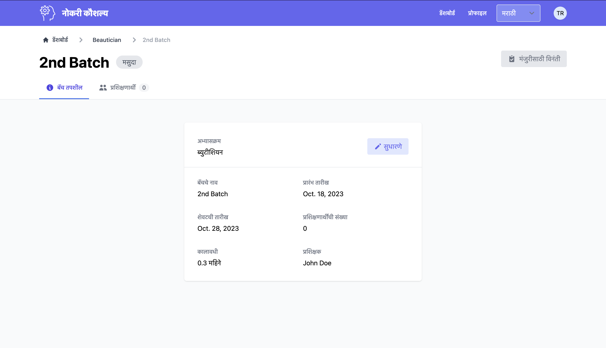

_More Screenshots of the App available at the bottom of the page._

## **Key Features**

-   **Training Center Dashboard:** Empowering training centers with efficient management tools.
-   **Trainees Dashboard:** A user-friendly space for trainees to access and manage their data.
-   **Super Admin Dashboard:** A comprehensive control center for administrators.
-   **Grouped Admins with Permissions:** Admins with varying levels of access and responsibilities.
-   **Multilanguage Support:** Jobskills.in supports both English and Marathi languages.
-   **Attendance Management:** Streamlined management of attendance records.
-   **Trainee Management:** Efficiently manage trainee data.
-   **Error Tracking with Rollbar:** Identify and address errors with precision.
-   **Elastic Beanstalk Hosting:** A dynamic hosting solution for seamless scalability.

## **Success in Numbers**

With more than 10,000 registered students, Jobskills.in has made headlines in the news. It's a testament to the platform's impact and effectiveness.

## **Unlock the Full Potential with Waak Labs**

Jobskills.in is a prime example of our commitment to practical web development solutions. At Waak Labs, we specialize in creating platforms that cater to specific needs. Beyond Jobskills.in, we have a wide range of web development services to meet your requirements.

If you're ready to streamline your operations and explore the full potential of web development, look no further than Waak Labs. Contact us today and let us redefine your web development experience.

**Experience the efficiency and impact of Jobskills.in and discover what Waak Labs can do for your web development needs.**

