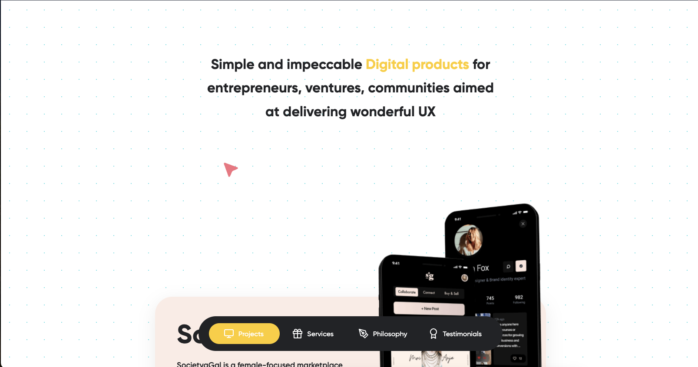

## **Key Features**

Our collaborative landing and marketing page for Laagom offers remarkable features, including:

-   **Drag & Drop Animations:** Enhance user experience with smooth, intuitive animations.
-   **Smooth Scroll with Momentum:** We've implemented Locomotive Scroll to provide a seamless, momentum-based scrolling experience.
-   **Markdown-Based Pages:** Create and manage content efficiently using Markdown.
-   **Custom Cursor with Beautiful Transitions:** We've developed a custom cursor with visually stunning transitions to add an extra layer of interactivity.

## **Explore Our Web Development Services at Waak Labs**

The collaboration between Laagom and Waak Labs highlights our commitment to crafting innovative web solutions. At Waak Labs, we specialize in web development that transforms ideas into reality. We offer a broad range of web development services tailored to your specific needs.

If you're ready to enhance your online presence and explore the full potential of web development, look no further than Waak Labs. Contact us today and let us redefine your web development experience.

**Experience the power of Laagom's Landing Paage and discover how Waak Labs can elevate your web development projects.**

