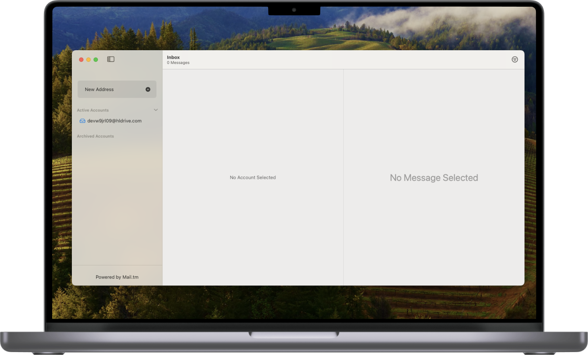
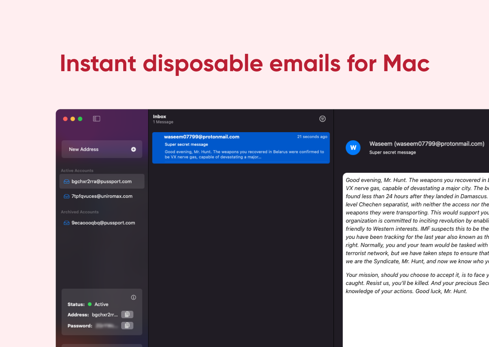
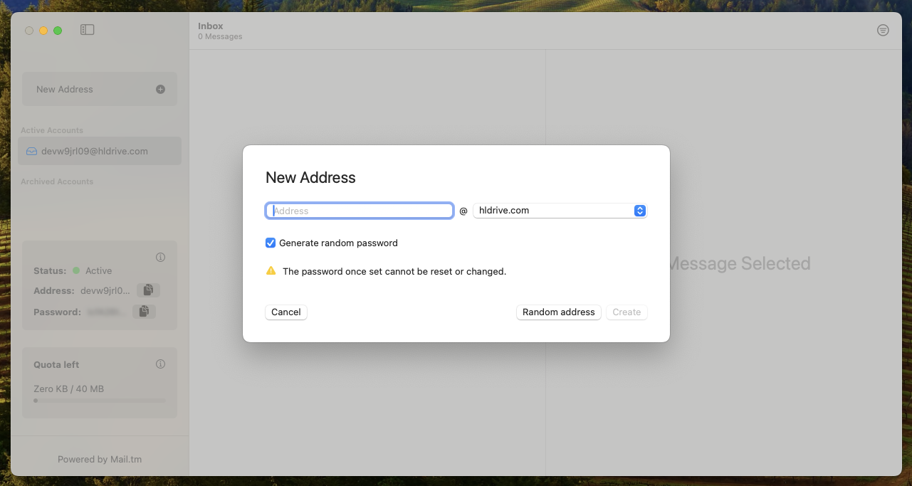
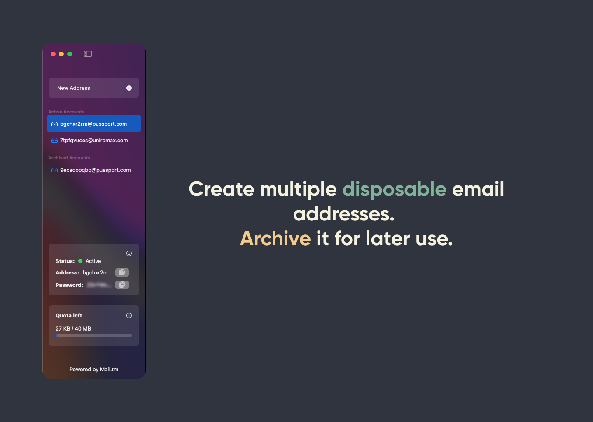
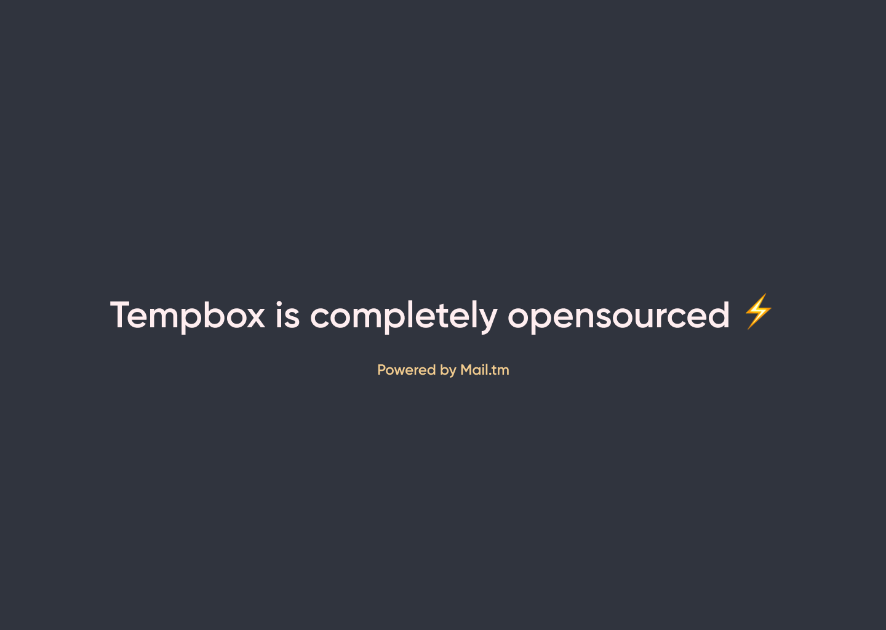

_More Screenshots of the App available at the bottom of the page._

## **Mac App Development Excellence**

At Waak Labs, we're proud to introduce Tempbox, a Mac application that aligns seamlessly with the Mac ecosystem, ensuring a user-friendly experience.

## **Effortless Convenience**

With Tempbox, you can easily create and manage multiple disposable email accounts.

## **Access and Control**

Tempbox allows you to download message sources and attachments, ensuring you always have your data at your fingertips.

## **Stay Informed**

Receive notifications for new messages so you never miss important communications.

## **Simplified Organization**

Tempbox lets you filter and prioritize unread messages for efficient organization.

## **Empowering Mac Users with Waak Labs**

Tempbox is just one example of our commitment to delivering top-tier Mac applications. At Waak Labs, we specialize in crafting native Mac solutions that enhance the Mac experience.

If you're ready to upgrade your Mac experience, look no further than Waak Labs. Our expertise extends beyond Tempbox, and we're here to provide you with tailored solutions for your Mac-centric needs.

**Experience the convenience and power of Tempbox and explore what Waak Labs can do for your Mac experience. Contact us today and let us redefine your Mac application development.**

