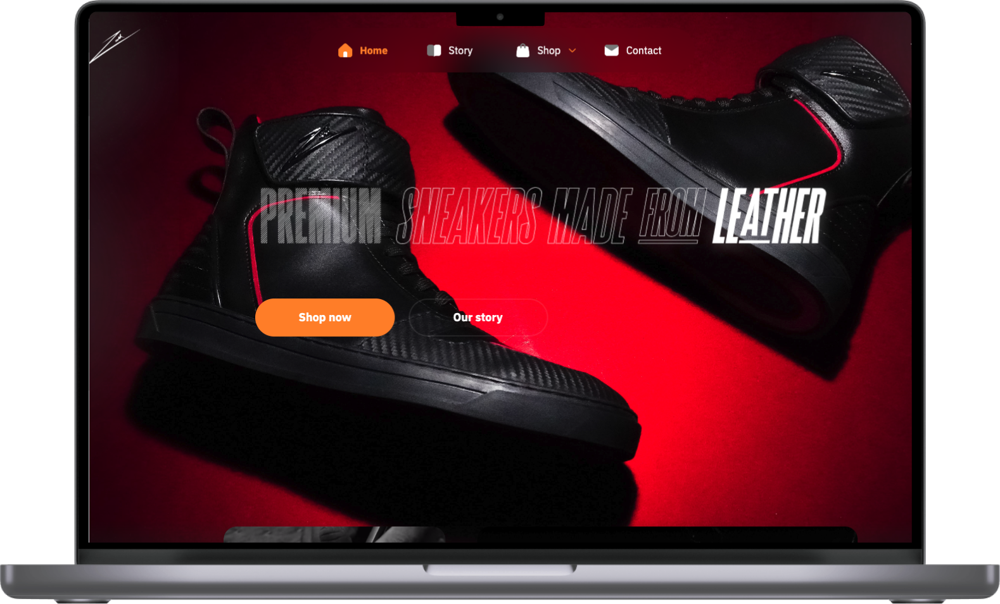

## **Key Features**

Our collaboration with Zeesh has resulted in an e-commerce app that offers essential features for a seamless shopping experience, including:

-   **Product Catalog:** A comprehensive catalog of high-end leather footwear and accessories.
-   **Secure Checkout:** Ensure safe and secure transactions for customers.
-   **User-Friendly Navigation:** Intuitive navigation for a hassle-free shopping experience.

## **Explore Our Web Development Services at Waak Labs**

The e-commerce app for Zeesh is a testament to our expertise in web development. At Waak Labs, we specialize in crafting functional web solutions. We offer a wide range of web development services tailored to meet your specific needs.

If you're ready to enhance your online presence and explore the full potential of web development, look no further than Waak Labs. Contact us today and let us redefine your web development experience.

**Experience the efficiency and impact of Zeesh, and discover how Waak Labs can elevate your web development projects.**
